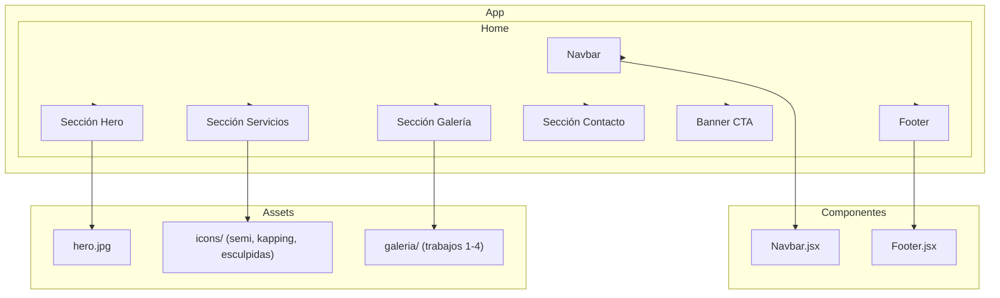

# Diagrama de diseño inicial — Holy Nails

Estructura de componentes de la Home (TP5). Renderizable en GitHub con Mermaid.

## Navegación

| Sección | Anchor | Contenido |
| --- | --- | --- |
| Inicio | `#inicio` | Hero con imagen y CTA a reservar turno |
| Servicios | `#servicios` | Tarjetas: Semipermanente, Kapping, Esculpidas |
| Galería | `#galeria` | Trabajos destacados + link a Instagram |
| Contacto | `#contacto` | WhatsApp, Instagram, ubicación y horarios |

## Stack

- **Cliente (frontend/):** React 19 + Vite + Bootstrap 5 (port 3000)
- **API (backend/ en raíz):** Django + Django REST Framework